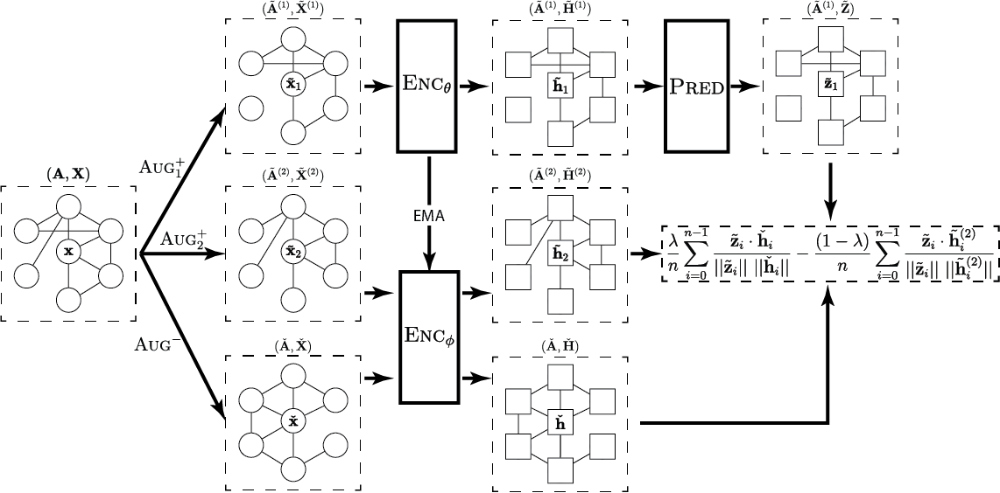

# Link Prediction with Non-Contrastive Learning

This respository contains the official implementation of T-BGRL, as well as re-implementations of GRACE, BGRL, GBT, and CCA-SSG adapted for link prediction. It also includes a max-margin-loss GCN implementation. Instructions on how to run each of the experiments can be found below.

While we do report and log ROC-AUC results, they should not be used as the primary evaluation metric since we perform early stopping (for the decoder) on validation `Hits@50`, rather than ROC-AUC. We also choose to optimize our parameters for `Hits@50` instead of ROC-AUC. We explain the rationale behind choosing `Hits@50` in our paper.

For more information, please check out our paper at https://arxiv.org/abs/2211.14394, and please cite our paper (details below) if you end up using the code in this repository.



## Setup

We provide a Dockerfile for setting up a Docker container with all of the required dependencies. You can set up the container and run our code by executing the following commands:

```bash
(host)      $ cd docker
(host)      $ docker run -it --name ncl-lp-run --mount type=bind,source="$(pwd)"/..,target=/code ncl-lp --gpus=all
(container) $ cd /code
(container) $ ./run_inductive.sh cora # replace with the desired dataset
```

If you do not have a GPU on your machine, you may run it without the `--gpus` flag and the code will use your CPU instead.

If you prefer not to use Docker, the packages required for running the code are enumerated in the `requirements.txt` file. You can try to install them with `pip install -r requirements.txt`, but you may run into issue installing `torch_geometric` and its associated packages. We suggest installed those packages in the order shown in [`setup.sh`](docker/setup.sh), which is used by our Dockerfile.

## Hardware Requirements

Most of the code should be able to run using only CPUs, but some models may require the use of CUDA-compatible GPUs. All experiments were conducted on either a NVIDIA V100 or P100 GPU. It is also recommended to have at least 8 CPU cores and 20 GB of RAM for the larger models.

## Model Settings

As described in the paper, we evaluate our models in both the transductive and inductive settings. For the transductive setting, we use a 85%/5%/10% training/validation/test data split. For the inductive setting, we use a 10%/30% (large dataset/small dataset) split at each stage (as described in the paper). The inductive splitting code can be found in the [`do_node_inductive_edge_split`](src/lib/utils.py) function.

## Reproducing Results

### T-BGRL

We ran Bayesian hyperparameter optimization for 25 runs on every model-dataset combination (including baselines). Each result is the result of the mean averaged over 5 runs (retraining both the encoder and decoder). The hyperparameters are optimized according to the mean validation `Hits@50` metric. We used the [Weights & Biases Bayesian optimizer](https://docs.wandb.ai/guides/sweeps). A sample W&B configuration file for CORA can be found at [`wandb_sample/tbgrl_cora.yaml`](wandb_sample/tbgrl_cora.yaml).

All transductive runs are performed with an embedding size of 256, and all inductive runs (due to the smaller datasets) are performed with an embedding size of 128.

The detailed run parameters for each BGRL run can be found in [`src/config`](src/config). Note that many of the parameters in those configs are unused (e.g. `hybrid_transition_epoch`). The most important parameters are listed below:

- `drop_edge_p_1`: the edge drop probability for the online encoder
- `drop_edge_p_2`: the edge drop probability for the target encoder
- `drop_feat_p_1`: the feature drop probability for the online encoder
- `drop_feat_p_1`: the feature drop probability for the target encoder
- `epochs`: number of epochs to train the model. Fixed at 10K for the (non-)contrastive models (like in the BGRL paper)
- `neg_lambda`: lambda value used to control the tradeoff between the BGRL loss and the term added by T-BGRL
- `negative_transforms`: which corruptions to use

The [`run_transductive.sh`](run_transductive.sh) and [`run_inductive.sh`](run_inductive.sh) bash scripts can be used to reproduce the results in the paper. For the transductive results:

```bash
./run_transductive.sh [dataset_name]
```

For the inductive results:

```bash
./run_inductive.sh [dataset_name]
```

where `[dataset_name]` is one of the following datasets:

- `amazon-computers`
- `amazon-photos`
- `coauthor-cs`
- `coauthor-physics`
- `citeseer`
- `cora`

The results are stored, by default, in `src/runs/[dataset_name]/[model_run_name]`, where `model_run_name` is generated using the runtime flags. Within that directory, `config.cfg` contains the configuration used to run the model, and `results.json` stores the results across the 5 runs.

### BGRL, GBT, and CCA-SSG

The BGRL, GBT, and CCA-SSG implementations all use the same file ([`src/train_nc.py`](src/train_nc.py)) with a different value for the `base_model` parameter:

- `bgrl`: BGRL implementation
- `gbt`: GBT implementation
- `cca`: CCA-SSG implementation

We perform hyperparameter optimization for all of these baseline models according to the settings described above (with the addition of model-specific parameters). They also all use the same GCN encoder and decoder.

### GRACE

The GRACE implementation is primarily from the [reference GRACE implementation](https://github.com/CRIPAC-DIG/GRACE). We run hyperparameter optimization according to the settings described above (with the addition of GRACE-specific parameters). We modified the code to use the same encoder size as the other models and to use a link prediction decoder. We also modified them for the transductive/inductive settings. The script can be found in [`src/train_grace.py`](src/train_grace.py).

### E2E-GCN

The end-to-end GCN implementation can be found in [`src/train_e2e.py`](src/train_e2e.py). This uses the same encoder as the methods above, but backpropogation is performed all the way through from the decoder. We run hyperparameter optimization according to the settings described above (with the addition of E2E-GCN-specific parameters).

### ML-GCN

We provide transductive and inductive max-margin-loss GCN implementation in the [`src/train_margin.py`](src/train_margin.py) file. For each anchor node, we use rejection sampling and try up to 3 times to obtain true negatives, but fall back to random nodes after 3 failed attempts (following the default behavior of the [`negative_sampling`](https://pytorch-geometric.readthedocs.io/en/latest/_modules/torch_geometric/utils/negative_sampling.html) function in PyG). We run hyperparameter optimization as described above (with the addition of ML-GCN-specific parameters).

### Additional Run Information

You can manually choose between running each model on the transductive and inductive splits with the `--split_method` flag. Specifically, `--split_method=transductive` will use the transductive split, and `--split_method=inductive` will use the inductive split.

For more information on what flags are available for a script, you can use the `--helpfull` flag. For example, `python src/train_nc.py --helpfull` will print out all accepted flags, as well as a short description of what each one does.

## Credit

We used significant portions of the code from the [reference BGRL implementation](https://github.com/nerdslab/bgrl) and the [reference GRACE implementation](https://github.com/CRIPAC-DIG/GRACE). We also used the evaluator and the transductive split function from [OGB](https://ogb.stanford.edu/docs/linkprop/).

If you use this code, please cite:

```
@article{shiao2022link,
  title={Link Prediction with Non-Contrastive Learning},
  author={Shiao, William and Guo, Zhichun and Zhao, Tong and Papalexakis, Evangelos E. and Liu, Yozen and Shah, Neil},
  journal={arXiv preprint arXiv:2211.14394},
  year={2022}
}
```